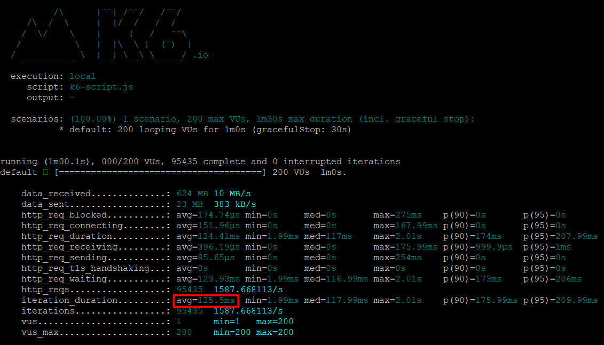
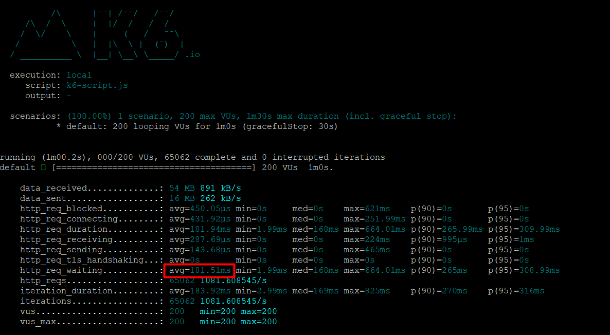

# Performance Analytics API

This REST API is working with the maximum instances that deployment environment allows and these instances are load balanced. Redis cache is also implemented for reading data.

## Install

    npm install

## Environment variables

Environment variables should be set before running application

```
MONGODB_URI=mongodbConnectionURI
PORT=3030
REDIS_HOST=redis-15592.c233.eu-west-1-1.ec2.cloud.redislabs.com
REDIS_PORT=15592
REDIS_PASS=redis password
```

## Run the app in development mode

    npm run dev

## Run the app in production mode

This will run application with pm2 cluster mode and instances will be load balanced

    npm run prod

# REST API

The REST API to the example app is described below.

## Get analytics

### Request

This endpoint's response is cached with Redis expiring in 5 seconds. This will have huge performance impact in read. Created an index for createdAt field.

`GET /analytics/`

    curl -i -H 'Accept: application/json' http://localhost:3030/analytics/

### Response

    [
      {
        "FCPTime": 100,
        "TTFBTime": 2,
        "domLoadTime": 1900,
        "windowLoadTime": 2000,
        "resourceLoadTime": 2300,
        "createdAt": "2021-01-03 23:32:11"
      }
    ]

### Performance with 200 virtual users per second



## Send analytics

### Request

This endpoint is working as fire-and-forget. It will return success without waiting DB save success. Message broker can be configured to make sure data is saved on any error but in this scenario, not saved record can be discarded.

`POST /analytics/`

```
curl --location --request POST 'http://localhost:3030/analytics' \
  --header 'Content-Type: application/json' \
  --data-raw '{
      "FCPTime": 1,
      "TTFBTime": 0.23,
      "domLoadTime": 2.3,
      "windowLoadTime": 3.56,
      "resourceLoadTime": 10.23
  }'
```

### Response

    {}

### Performance with 200 virtual users per second


